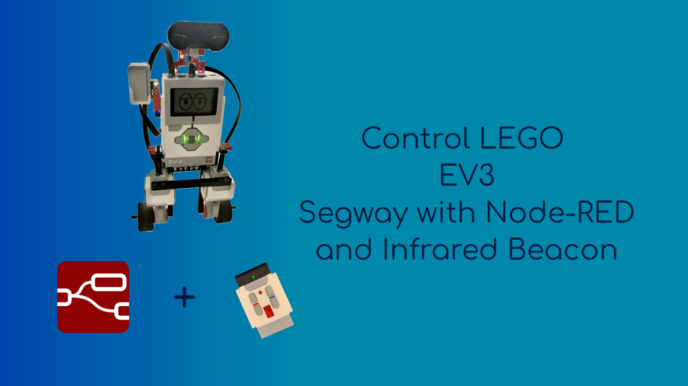

# Lego EV3 Segway

A segway robot is built with the LEGO MINDSTORMS EV3 robot kit and the EV3 Gyro sensor. The self-balancing code is written in MicroPython using EV3 MicroPython which runs on top of the ev3dev Operating System (OS).

The robot can be controlled in two ways:

- **directional control** from a Node-RED flow with the segway as an MQTT client. Commands to move forward, backward, turn left or right
can be sent to the Segway via an MQTT broker. This control method is dubbed **MQTT mode**. 

- **tether control** using the EV3 infrared sensor and beacon. In this mode, the segway follows the beacon by rotating (using a Proportional
controller) to reduce the angle between them to less than 10 degrees, then it translates towards the beacon (using a Proportial 
Derivative (PD) controller) until it gets close to it then stops. This control method is dubbed **beacon mode**, which is shown in the animation below.

<p align='center'>
  
</p>

- [Lego EV3 Segway](#lego-ev3-segway)
  - [Hardware](#hardware)
  - [Software Installation](#software-installation)
    - [EV3 MicroPython Setup](#ev3-micropython-setup)
    - [Network Connection](#network-connection)
    - [SSH Connection to EV3](#ssh-connection-to-ev3)
    - [Clone Project Repository](#clone-project-repository)
    - [MQTT and Node-RED setup](#mqtt-and-node-red-setup)
      - [MQTT Publisher](#mqtt-publisher)
      - [MQTT Subscriber](#mqtt-subscriber)
  - [Main program](#main-program)
    - [Initializations](#initializations)
    - [update\_action() generator function](#update_action-generator-function)
      - [MQTT mode for directional control with Node-RED](#mqtt-mode-for-directional-control-with-node-red)
      - [Beacon mode for tether control with beacon](#beacon-mode-for-tether-control-with-beacon)
    - [Main program loop](#main-program-loop)
      - [Battery voltage check](#battery-voltage-check)
      - [Initialize balancing loop variables](#initialize-balancing-loop-variables)
      - [Prepare update\_action() generator](#prepare-update_action-generator)
      - [Calibrate gyro offset](#calibrate-gyro-offset)
      - [Balancing loop](#balancing-loop)
        - [Calculate robot body angle and rate, and wheel angle and rate](#calculate-robot-body-angle-and-rate-and-wheel-angle-and-rate)
        - [Calculate output power to drive motors](#calculate-output-power-to-drive-motors)
        - [Check if output power is +/- 100% for more than 1 second](#check-if-output-power-is---100-for-more-than-1-second)
        - [Get the next drive\_speed and steering values from update\_action()](#get-the-next-drive_speed-and-steering-values-from-update_action)
  - [Project Demonstration](#project-demonstration)
  - [References](#references)

## Hardware

The following components were used for this project:

- LEGO MINDSTORMS EV3 Home Edition #31313
- [EV3 Gyro Sensor](https://raisingrobots.com/product/gyro-sensor/)
- MicroSD card (minimum of 2GB and a maximum of 32GB)
- [EDIMAX EW-7811Un wireless USB adapter](https://www.edimax.com/edimax/merchandise/merchandise_detail/data/edimax/in/wireless_adapters_n150/ew-7811un/)
- PC or single board computer (to run the MQTT broker and Node-RED) with an internet connection

The robot build instructions are available [here](https://robotsquare.com/2014/06/23/tutorial-building-balanc3r/).

## Software Installation

### EV3 MicroPython Setup

In order to use EV3 MicroPython, the EV3 MicroPython image file is flashed onto a micro SD card and inserted into the microSD card slot on the side of the EV3 brick. The full installation process is available in this [guide](https://pybricks.com/ev3-micropython/startinstall.html).

In the guide, [Visual Studio Code](https://code.visualstudio.com/Download) is used in writing MicroPython programs and installing the EV3 MicroPython extension. After successfully flashing the image onto the microSD card, insert the card into the slot and turn on the EV3 brick by pressing the dark gray center button. An overview of how to navigate the different menus on the EV3 brick can be found in this [guide](https://pybricks.com/ev3-micropython/startbrick.html).

### Network Connection

The MQTT mode requires a connection between the host PC and the EV3 for messages to be sent and received via the MQTT broker running on the PC. The first step to establishing this connection on the EV3 is having Wi-Fi connectivity, the EDIMAX EW-7811Un Wi-Fi USB dongle is used for this purpose. 

Plug in the dongle into the EV3 bricks' USB port, then navigate to the ***Wireless and Networks > Wi-Fi*** menu on the brick. Check the ***"Powered"*** box to enable to Wi-Fi network search then connect to the network the PC is on. It is advisable to set a static IP address for the EV3 on one's router.

<p align='center'>
  
  
</p>

<p align='center'>
  
  
</p>

Other networking options are detailed [here](https://www.ev3dev.org/docs/networking/).

### SSH Connection to EV3

With the network connection set up, the next thing is configure an SSH connection to the EV3. This will enable commands to be sent to the robot, over the network, to run programs, change settings and install packages.

This ev3dev [guide](https://www.ev3dev.org/docs/tutorials/connecting-to-ev3dev-with-ssh/)  sets up the SSH connection which has instructions for MacOS, Ubuntu and Windows.
The SSH connection is also necessary if one wants to use the [Visual Studio Code Remote - SSH extension](https://code.visualstudio.com/docs/remote/ssh) to edit files easily in VS Code. On working on the project, however, after a while the VS Code remote connection to the robot could not be established, this issue is nonexistent when creating an ssh connection to the robot using a terminal window; this method will be used herein.

### Clone Project Repository

Execute the following the command in a terminal window to create an ssh connection to the robot:
```
ssh robot@ev3dev.local
```

Then run this command to clone the project repository:
```
git clone https://github.com/TheNoobInventor/lego-ev3-segway.git
```

***Note***: If you encounter issues cloning the repository, you can download a zipped version of the repository, send it the segway then unzip it. These can be achieved by running the following commands.

First of all, open the project GitHub link then download the zip repository file by clicking on the button as shown in the image below.

<p align='center'>
  
</p>

Open up a terminal and navigate to the Downloads directory
```
cd Downloads
```

Secure copy (SCP) is used to send the downloaded zipped file to segway. However, the segway IP address is required for this action. One way of obtaining this is downloading and running the [Angry IP Scanner](https://angryip.org/) application. It scans for devices on your network and returns their hostnames and respective IP addresses. The hostname for the robot is `ev3dev.local` as shown in the screenshot of Angry IP Scanner below.

<p align='center'>
  
</p>

Execute this command to send the zipped file to the segway

```
scp lego-ev3-segway-master.zip robot@ipaddress:
```

Run this command to unzip the zipped repository file
```
unzip lego-ev3-segway-master.zip
```

Then remove zip file with this
```
rm lego-ev3-segway-master.zip
```

### MQTT and Node-RED setup

Messaging Queuing Telemetry Transport (MQTT) is a protocol commonly used for message exchange between devices, sensors, computers etc. It uses a [publish and subscribe architecture](https://ably.com/topic/pub-sub) such that a device, an MQTT client, can publish a message on a topic to an MQTT broker and other MQTT clients subscribe to the topic to receive the message.

The MQTT broker acts as an intermediary between devices by dispatching messages published on a topic from one client to other client(s) that subscribe to the same topic. A client can be both a publisher and subscriber. 

MQTT messages contain a payload with the data to be consumed by the client, in the case of the LEGO segway, the payload will contain commands, for instance **"TURN LEFT"**, to control the segway. Payloads can be strings, JSON, binary data, or even custom formats that are application specific.

In this project, the MQTT broker and one MQTT client, Node-RED, are installed on the PC. The mosquitto MQTT broker is used and can be installed on a number of operating systems, distributions, or platforms; mosquitto can be downloaded from [here](https://mosquitto.org/download/). 

Node-RED is a flow-based programming tool that makes the process of connecting hardware devices, APIs and online services easier. It has built-in support for MQTT and similar to the MQTT broker, it can be installed on a number of operating systems or platforms. Node-RED can be downloaded [here](https://nodered.org/docs/getting-started/local), Ubuntu is the operating system used for this project. Node-RED was installed with the Raspberry Pi [bash script](https://nodered.org/docs/getting-started/raspberrypi) as both Ubuntu and Raspberry Pi OS are Debian-based operating systems.

To run Node-RED, open a terminal window and type in this command:
```
node-red
```

This will spin up a local server which can be accessed by opening up the link in a browser. From the screenshot below, Node-RED is available at http://127.0.0.1:1880/.

<p align='center'>
  
</p>

Clicking on this link opens the Node-RED editor:

<p align='center'>
  
</p>

In the case of Ubuntu, once the mosquitto MQTT broker is installed, the broker automatically starts as a `systemd` service. This can be confirmed by executing this command:

```
systemctl status mosquitto.service
```

Which will output:

<p align='center'>
  
</p>

To stop the mosquitto service run this command:

```
systemctl stop mosquitto.service
```

And to start it up again:

```
systemctl start mosquitto.service
```

To create a connection between the Node-RED MQTT client and mosquitto, search for the following nodes at the top left corner of the Node-RED editor and drag them into the flow workspace: *inject*, *mqtt in*, *mqtt out* and *debug*. Then wire (or connect) the *debug* and *mqtt in* nodes by clicking the grey box (port) of the *mqtt in* node and dragging the wire to the *debug* node. Likewise, create a connection from the *inject* node to the *mqtt out* node. The comment nodes below were added to explain what functionalities were being tested.

<p align='center'>
  
</p>

#### MQTT Publisher

The installed mosquitto broker comes with MQTT clients that can be used to publish (`mosquitto_pub`) and subscribe (`mosquitto_sub`) to topics on the command line. Before demonstrating publishing in MQTT, the MQTT broker needs to be set up and this will be done in Node-RED.

First, double click on the *mqtt in* node and on the right of the *Server* field click on edit button.

<p align='center'>
  
</p>

Input a name for the broker, the IP address of the PC/computer the broker is installed on, then click on the *Add* button.

<p align='center'>
  
</p>

Next add a topic name, in this case **'test/topic'** was chosen, then click on *Done*. Afterwards click on the *mqtt out* node and choose the broker that was just set up and input the topic name as well. Confirm these inputs by clicking on *Done*.

<p align='center'>
  
</p>

To effect the changes made, click on the *Deploy* button at the top right corner of the Node-RED tab.

<p align='left'>
  
</p>

A "connected" text is shown under the *mqtt in* node to signify that a connection has been established with the mosquitto MQTT broker.

<p align='center'>
  
</p>

To see messages in Node-RED, click on the **debug** logo as shown below.

<p align='center'>
  
</p>

To demonstrate publishing with MQTT, open up a terminal and publish the message **"Hello World"** on the topic **'test/topic'** using the `mosquitto_pub` client:

```
mosquitto_pub -t test/topic -m "Hello World"
```

This message is seen in the debug panel of Node-RED.

<p align='center'>
  
</p>

#### MQTT Subscriber

Double click on the *mqtt out* node and choose the broker that was just set up and type in the same topic name as well. Confirm these inputs by clicking on *Done*.

<p align='center'>
  
</p>

Click again on the *Deploy* button to save these changes.

The `mosquitto_sub` client will be used to demonstrate MQTT subscription. The client subscribes to the topic **'test/topic'** to receive any incoming messages published from Node-RED.

First, double click on the *inject* node, choose a name for it, then change the payload type from **timestamp** to a **string**.

<p align='center'>
  
</p>

Type in a message to be sent, input the message topic as **'test/topic'** then click on *Done*.

<p align='center'>
  
</p>

To subscribe to any messages published on **'test/topic'** by Node-RED, using the `mosquitto_sub client`, open a terminal and run this command:

```
mosquitto_sub -t test/topic
```

To publish the message from the Node-RED client, click on the button on the left of the `inject` node as shown below.

<p align='center'>
  
</p>

The published message is received by the `mosquitto_sub` client.

<p align='center'>
  
</p>

The message is also shown in the Node-RED debug panel. 

<p align='center'>
  
</p>

## Main program 

With all the requisite software installed and setup, it's time to delve into the main segway program. The code for the segway is modified from the [Gyro Boy project](https://pybricks.com/ev3-micropython/examples/gyro_boy.html) which balances the Gyro Boy on its two wheels by making use of the EV3 Gyro sensor. The `main.py` Python script contains a lot of lines of code with helpful comments, however, the major parts of the program is summarized in the flow chart below.

<p align='center'>
  
</p>

### Initializations

The program starts by initializing the EV3 brick, the two motors, the infrared and gyro sensors and various constants and variables. Some of these variables include a `namedtuple` (a container datatype in the [collections module](https://docs.python.org/3/library/collections.html)) called *Action* used to define the `drive_speed` and `steering` values for particular robot actions. These values are used later in the control feedback calculation, that is, to calculate the output power of the motors, to balance the segway when in motion or a stationary position. 

```
# Robot action definition used to change how the robot drives
Action = namedtuple('Action', ['drive_speed', 'steering'])

# Pre-defined robot actions
FORWARD = Action(drive_speed=150, steering=0)
BACKWARD = Action(drive_speed=-60, steering=0)
TURN_LEFT = Action(drive_speed=0, steering=80)
TURN_RIGHT = Action(drive_speed=0, steering=-80)
STOP = Action(drive_speed=0, steering=0)
```

Another set of variables that are initialized is a dictionary of Node-RED command states. The states are all initialized as `False` but when a command is received from Node-RED the corresponding command state is set to `True` with the respective action executed by the Segway. This process will be elaborated on in the [directional control](#mqtt-mode-for-directional-control-with-node-red) subsection.

```
# Initialize Node-RED command states
Node_RED_Command = {
    'move_forward': False,
    'move_backward': False,
    'turn_right': False,
    'turn_left': False,
}
```

The EV3 MicroPython image has the lightweight MQTT client, [`umqtt`](https://mpython.readthedocs.io/en/v2.2.1/library/mPython/umqtt.simple.html), built in. It is imported in the main program as follows:

```from umqtt.simple import MQTTClient```

However, to ensure that the segway can connect to MQTT broker without any authentication requirements, the mosquitto configuration file need to be slightly modified. First stop the mosquitto service and open the `mosquitto.conf` file with an editor with admin privileges:

```
sudo vim /etc/mosquitto/mosquitto.conf
```

Add these lines to the end of the file:

```
listener 1883 0.0.0.0
allow_anonymous true
```

Save these changes then start up the mosquitto service again. More information about configuring mosquitto is available [here](https://mosquitto.org/man/mosquitto-conf-5.html).

The code snippet below shows the procedure the segway uses to establish an MQTT connection with mosquitto, where the `BROKER` constant is the IP address of the MQTT broker. The client subscribes to the topic **'nodered/commands'** to receive messages from Node-RED and to test its MQTT connection, it publishes the message **"Publishing test"** on the same topic.

```
# MQTT connection setup
MQTT_ClientID = 'Segway'
BROKER = '192.168.1.111'
client = MQTTClient(MQTT_ClientID, BROKER)
client.connect()

Topic = 'nodered/commands'
client.set_callback(get_commands)
client.publish(Topic, 'Publishing test')
client.subscribe(Topic)
```

### update_action() generator function

The final step before stepping into the main program loop is defining the `update_action()` generator function. A Python generator function is a function that returns a lazy iterator, or an on-demand iterable object. These objects can be looped over like a list, however, unlike lists, lazy iterators do not store their contents in memory.

A generator function, or simply a generator, differs from a normal Python function as it uses a `yield` statement instead of the `return` statement.

Consider the simple script below.

```
def test():
    yield 1
    yield 2
    yield 3

values = test()

print(values)
print(next(values))
print(next(values))
print(next(values))
```

The following output is obtained after the script is executed:
```
<generator object test at 0x7f381be2e1f0>
1
2
3
```

At the point, `values = test()`, when the generator is called, it does not execute the function body immediately. Instead it returns a generator object, which was printed out with `print(values)`. The `yield` keyword produces a value from the generator. The `next()` function loops over the object and outputs the yielded numbers `1, 2, 3` from `print(next(values))`; `for` loops can also be used to iterate over generators. 

When a generator calls `yield` it is momentarily passing control back to the code looping over the generator values. The `next()` function, or `for` loop, then passes control to the generator which yields a value back. This exchange of control continues until there are no more yields in the generator.

The YouTube video by [Socratica](https://www.youtube.com/watch?v=gMompY5MyPg) and these tutorials by [RealPython](https://realpython.com/introduction-to-python-generators/) and [Programiz](https://www.programiz.com/python-programming/generator) provide more detailed information and examples on Python generators.

In the case of this project, the `update_action()` generator checks for directional control messages from Node-RED --- on the **'nodered/commands'** topic --- and if the beacon is on and in range, `yield` is used update the `drive_speed` and `steering` values accordingly with: 

```
yield action
```
For instance, to turn the segway to the left, the `drive_speed` and `steering` values are updated with this predefined robot action:
```
yield TURN_LEFT
```
These values are looped over by the main progam control loop and used to calculate the output power of the motors. To ensure that no function calls are made that would otherwise affect the control loop time in the main program, those calls yield to the control loop while waiting for a certain thing to happen like this:

    while not condition:
        yield

As shown in the figure below, the `update_action()` generator contains the segway's MQTT and Beacon modes of operation. The respective steps for each mode are covered in the subsequent subsections.

<p align='center'>
  
</p>

#### MQTT mode for directional control with Node-RED

The flow chart below summarizes the steps to run the segway in MQTT mode to achieve directional control using Node-RED.

<p align='center'>
  
</p>

It was established in the initializations [subsection](#initializations) that the segway MQTT client is subscribed to the **'nodered/commands'** topic. The client checks for messages sent from Node-RED, via the MQTT broker, by calling the `umqtt` function, `check_msg()` function at the start of the `update_action()` generator as shown in the following snippet. 

```
# Check for messages from the MQTT broker
client.check_msg()
```

The image below shows the Node-RED flow used to inject directional command messages on the **'nodered/commands'** topic. 

<p align='center'>
  
</p>

If any message is received from the broker, the message is passed to callback function, `get_commands()`. The `umqtt` function, `set_callback()`, is used to set `get_commands()` as a callback function as shown.

```
client.set_callback(get_commands)
```

The `get_commands()` callback function decodes the received message, compares it the string versions of the pre-defined robot actions then sets the value of the corresponding Node-RED dicionary command key to **"True"** (Recall that Node-RED command state values were initialized as **"False"**). The callback function definition is shown in the snippet below.

```
# MQTT callback function
def get_commands(topic, msg):
    if msg.decode() == "FORWARD":
        Node_RED_Command['move_forward'] = True

    if msg.decode() == "BACKWARD":
        Node_RED_Command['move_backward'] = True
    ...
```

The next step in the flow chart is to check which Node-RED command state is **"True"**. If one of the command states is **"True"**, for instance `'move_forward'`, the `drive_speed` and `steering` values are updated for the main program loop to drive the segway forward by running the command `yield FORWARD`. 

This process is shown in the snippet below where the segway is driven forward for `5 seconds` before setting the `'move_forward'` command state back to **"False"**.

```
# MQTT mode
if Node_RED_Command['move_forward'] == True:
    yield FORWARD 
    # Drive forward for 5 seconds, then stop
    while action_timer.time() < 5000:
        yield
    yield STOP
    Node_RED_Command['move_forward'] = False
    ...
```

If all the command states are **"False"** or after all the command state checks are done, the MQTT mode transitions to the beacon mode.

The image below shows the connection between the MQTT clients and mosquitto.

<p align='center'>
  
</p>

#### Beacon mode for tether control with beacon

Recall that in the beacon mode, the segway follows the infrared beacon by rotating (if the angle between them is greater than `10` degrees), translating towards the beacon (when the angle is less than `10` degrees) and stops when the segway gets close to the beacon. 

To enable tether control of the segway, the beacon has to be turned on, set to channel `1` (as shown below) and be within range of the infrared sensor.

<p align='center'>
  
</p>

The following flow chart delineates the steps of setting up tether control of the segway when in beacon mode. 

<p align='center'>
  
</p>

The first step is to confirm that the `relative_distance` value is not `None`. The `beacon(channel)` is used to measure the relative distance and angle between the infrared sensor and the beacon. 

```
relative_distance, angle = infrared_sensor.beacon(1)
```

The `relative_distance` ranges from `0` to `100`  while the `angle` is an approximate value of -`75` to `75` degrees between the sensor and beacon. If the tuple above returns `(None, None)`, this signifies that the beacon isn't detected by the infrared sensor. 

From the chart, if the `relative_distance` is `None` (which implies that `angle` is also `None`), the `yield` keyword is used to pass control to the main program loop. Otherwise, a Proportional (P) controller, a variant of the Proportional Integral Derivative (PID) controller, is utilized in calculating the `steering` value of the Action `namedtuple`. This is obtained by multiplying the angle error term, which is the difference between `0` and the obtained angle from the beacon, by the controller gain or constant attained through experimentation. The following snippet shows this process.

```
if relative_distance is not None:
  angle_error = 0 - angle
  K_angle = 4 # controller gain
  steering = K_angle * angle_error
  action = Action(drive_speed=0, steering=steering)
  yield action
```

The `drive_speed` is set to `0` in the newly formed Action. This action is passed to the main program loop to calculate the motor output power required to reduce the angle between the segway and the beacon, thus rotating the robot.

As the robot rotates towards the beacon, if the `angle_error` is less than `10` degrees, a Proportional Derivative (PD) controller, another PID controller variation, is used to calculate the `drive_speed` value for a new robot Action. In this case, the error term is the difference between `100` and the `relative_distance` obtained from the beacon. Similarly, the Proportional controller multiplies this error with the controller gain which is added to the Derivative controller, which multiplies the change in the error over time by its controller gain.

The `steering` value is set to `0` and the action is yielded to the main program loop to drive the robot forward towards the beacon. When the `relative_distance` between the robot and beacon is less than `10` the robot action `STOP` is yielded. This process is shown in the code snippet below.

```
if abs(angle_error) < 10:
  error = 100 - relative_distance
  d_error = (error - prev_error)/action_timer.time()
  K_p, K_d = 6, 2.5 # controller gains

  drive_speed = K_p * error + K_d * d_error
  action = Action(drive_speed=drive_speed, steering=0)
  prev_error = error
  
  if relative_distance > 10:
      yield action
  else:
      yield STOP
```

Whenever control is passed back to the update_action() generator, the MQTT and beacon mode code blocks are re-executed.

Some introductory resources on PID controllers are available [here](https://www.youtube.com/watch?v=UR0hOmjaHp0) and [here](https://www.digikey.com/en/maker/projects/introduction-to-pid-controllers/763a6dca352b4f2ba00adde46445ddeb).

### Main program loop

Having set up the EV3 brick, motors and sensors, constants and variables, the MQTT connection and defined the `update_action()` generator, the main program loop that balances the segway and moves it according to the respective modes, will now be considered. 

<p align='center'>
  
</p>

#### Battery voltage check

The main loop starts by checking if the battery voltage is greater than `7.5V` otherwise the motors will be underpowered for any movements. If the voltage is less than `7.5V`, code execution stops by breaking out of the main program loop. 

```
# Calculate current battery voltage
battery_voltage = (ev3.battery.voltage())/1000

# Battery warning for voltage less than 7.5V and breaks out of the loop
if battery_voltage < 7.5:
    ev3.light.on(Color.ORANGE)
    ev3.screen.load_image(ImageFile.DIZZY)
    ev3.speaker.play_file(SoundFile.UH_OH)
    break
```
#### Initialize balancing loop variables

The next step is to initialize the balancing loop variables. Some of these include resetting the motor rotation angles to zero, and setting the `drive_speed` and `steering` values to zero (before receiving updated values from the `update_action()` generator). 

```
# Reset sensors and initialize variables
left_motor.reset_angle(0)
right_motor.reset_angle(0)
fall_timer.reset()

motor_position_sum, wheel_angle = 0, 0
motor_position_change = [0, 0, 0, 0]
drive_speed, steering = 0, 0
control_loop_counter = 0
robot_body_angle = -0.2
```

The balancing loop is nested in the main program loop and as the name suggests, is the block of code that calculates the output power for the motors to keep the segway balanced when in motion or in a stationary position.

#### Prepare update_action() generator

Here, the `update_action()` generator is called but is not executed. 

```
# Prepare the generator, update_action(), for use later
action_task = update_action()
```

The function body is only executed towards the end of the balancing loop, where the `next()` function is used to obtain the next `drive_speed` and `steering` values yielded from the `update_action()` generator.

#### Calibrate gyro offset

Finally, the gyro sensor offset is calculated before stepping into the balancing loop. Gyroscopes are susceptible to drifting which can cause the measured rate to return a non-zero value even when the sensor is stationary. This non-zero value is the gyro offset and this value will need to be maintained to adjust the gyro sensor value to get more accurate readings. 

The EV3 gyro sensor has a maximum rate of rotation of `440 deg/s`. Before the segway starts to balance, it obtains an initial gyro offset by taking the average of `200` sensor readings, in a `for` loop, while the robot is held still in an upright position. The calibrating loop is executed if the difference between the updated maximum and minimum gyro rates is less than `2 deg/s` after averaging the `200` sensor readings; the number `200` is the `GYRO_CALIBRATION_LOOP_COUNT` constant [initialized](#initializations) at the start of the program. 

Immediately after, the robot's 'eyes' are [awake](https://pybricks.com/ev3-micropython/media.html#pybricks.media.ev3dev.ImageFile.AWAKE), the EV3 brick led turns green and the robot starts self balancing --- a process which is explained further in the next subsection --- and ready to enter the MQTT or beacon mode. 

```
while True:
    gyro_min_rate, gyro_max_rate = 440, -440 
    gyro_sum = 0
    for _ in range(GYRO_CALIBRATION_LOOP_COUNT): 
        gyro_sensor_value = gyro_sensor.speed()
        gyro_sum += gyro_sensor_value
        if gyro_sensor_value > gyro_max_rate:
            gyro_max_rate = gyro_sensor_value
        if gyro_sensor_value < gyro_min_rate:
            gyro_min_rate = gyro_sensor_value
        wait(5)
    if gyro_max_rate - gyro_min_rate < 2: 
        break
gyro_offset = gyro_sum / GYRO_CALIBRATION_LOOP_COUNT
```

<p align='center'>
  
</p>

#### Balancing loop

At the start of the balancing loop, the `single_loop_timer` is reset to measure how long a single loop takes. This is done to keep the balancing loop time consistent even when different actions are happening.

Also at the beginning of the balancing loop, the `average_loop_control_period` is calculated. This variable utilizes the `control_loop_timer` and is used in the following subsection for the control feedback calculation. The `control_loop_counter` in the snippet below was initialized [here](#initialize-balancing-loop-variables).

```
# This timer measures how long a single loop takes. This will be used to help keep the loop time 
# consistent, even when different actions are happening.
single_loop_timer.reset()

# This calculates the average control loop period. This is used in the control feedback 
# calculation instead of the single loop time to filter out random fluctuations.
if control_loop_counter == 0:
    # The first time through the loop, we need to assign a value to
    # avoid dividing by zero later.

    # Dividing by 1000 because default time is in milliseconds
    average_control_loop_period = TARGET_LOOP_PERIOD / 1000
    control_loop_timer.reset()
else:
    average_control_loop_period = (control_loop_timer.time() / 1000 / control_loop_counter)
control_loop_counter += 1
```

The program constant, `TARGET_LOOP_PERIOD`, is the maximum amount of time allowed for the output power calculation to be completed, and is set to `20 milliseconds`. 

##### Calculate robot body angle and rate, and wheel angle and rate

The initial gyro offset obtained two subsections ago will need to be continually adjusted as the robot drives. This is done in order to keep the value from drifting over time. To achieve this, the GyroBoy project employed an exponential moving average. The `robot_body_rate` variable, which is the angular velocity (or speed) of the gyro sensor, augments its value with the adjusted gyro offset as shown below.

```
# Calculate robot body angle and rate (or speed)
gyro_sensor_value = gyro_sensor.speed()
gyro_offset *= (1 - GYRO_OFFSET_FACTOR)
gyro_offset += GYRO_OFFSET_FACTOR * gyro_sensor_value
robot_body_rate = gyro_sensor_value - gyro_offset
robot_body_angle += robot_body_rate * average_control_loop_period

# Motor angle values
left_motor_angle, right_motor_angle = left_motor.angle(), right_motor.angle()

# Calculate wheel angle and rate, the wheel rate is calculated using a moving average on 4 item motor_position_change list
previous_motor_sum = motor_position_sum
motor_position_sum = left_motor_angle + right_motor_angle
change = motor_position_sum - previous_motor_sum
motor_position_change.insert(0, change)
del motor_position_change[-1]
wheel_angle += change - drive_speed * average_control_loop_period
wheel_rate = sum(motor_position_change) / 4 / average_control_loop_period
```

The `wheel_rate`, or motor speed, is calculated using a moving average on the 4 item `motor_position_change` list initialized [here](#initialize-balancing-loop-variables).

##### Calculate output power to drive motors

The control feedback calculation or the output_power sent to the motors, is calculated with the expression below

```
# This is the main control feedback calculation
output_power = (-0.01 * drive_speed) + (1.2 * robot_body_rate +
                                          28 * robot_body_angle +
                                          0.075 * wheel_rate +
                                          0.12 * wheel_angle)
```

The coefficients of variables, `robot_body_rate`, `robot_body_angle`, `wheel_rate` and `wheel_angle`, were obtained iteratively. It is advisable to start by only changing one constant in the tuning process before moving on to another variable, then circle back as need to make further adjustments. 

The calculated output power is constrained to `+/- 100%` which matches the range of the `dc` [method](https://pybricks.com/ev3-micropython/ev3devices.html#pybricks.ev3devices.Motor.dc) used to drive the motors. Finally, the motors are driven at the output power calculated in the respective `steering` directions.

```
# Motor limits
if output_power > 100:
    output_power = 100
if output_power < -100:
    output_power = -100

# Drive motors
left_motor.dc(output_power - 0.1 * steering)
right_motor.dc(output_power + 0.1 * steering)
```

##### Check if output power is +/- 100% for more than 1 second

A check is performed in the balancing loop to determine if the robot has fallen over. If the output speed is `+/- 100%` for more than a second, the robot no longer balances properly, and is falling (or has fallen) over. If this happens, the motors are stopped and the program waits for 3 seconds to allow the user enough time to put the segway back in an upright position before the program tries balancing again.

```
  # Check if robot fell down. If the output speed is +/-100% for more than one second, 
  # we know that we are no longer balancing properly.
  if abs(output_power) < 100:
      fall_timer.reset()
  elif fall_timer.time() > 1000:
      break

    ...

# Handle falling over. If we get to this point in this program, it means
# that the robot fell over.

# Stop all motors
stop_motors()

# Knocked out eyes and red light let us know that the robot lost its balance
ev3.light.on(Color.RED)
ev3.screen.load_image(ImageFile.KNOCKED_OUT)
ev3.speaker.play_file(SoundFile.SPEED_DOWN)

# Wait for a few seconds before trying to balance again
wait(3000)
```

##### Get the next drive_speed and steering values from update_action()

In the final step of the balancing loop, the `next()` function runs to obtain the `driving_speed` and `steering` values, for the next balancing loop iteration, from the `update_action()` generator.

At the end of each loop iteration, the program waits for a period of time --- the difference of the `TARGET_LOOP_PERIOD` and the elapsed time of the current loop --- to keep the loop time consistent. The next iteration starts by calculating the robot body, wheel angles and rates, the subsequent steps and the cycle continues.

```
# This runs update_action() until the next "yield" statement
action = next(action_task)
if action is not None:
    drive_speed, steering = action

# Make sure loop time is at least TARGET_LOOP_PERIOD. The output power calculation 
# above depends on having a certain amount of time in each loop.
wait(TARGET_LOOP_PERIOD - single_loop_timer.time())
```

## Project Demonstration

The video below walks through each step of setting up the segway to be controlled using Node-RED and the infrared beacon.

[](https://youtu.be/rd8de9ClbUM)

## References

- [EV3 Devices](https://pybricks.com/ev3-micropython/ev3devices.html)
- [GyroBoy](https://pybricks.com/ev3-micropython/examples/gyro_boy.html)
- [Mosquitto docs](https://mosquitto.org/documentation/)
- [HiveMQ](https://www.hivemq.com/mqtt/)
- [NodeRED](https://nodered.org/about/)
- [TheThingsIndustries](https://www.thethingsindustries.com/docs/integrations/node-red/)
- [HackMD: Installing and Using MQTT Broker (Mosquitto) & Node-Red](https://hackmd.io/@lnu-iot/rJr_nGyq5#:~:text=Connecting%20Node%2DRed%20to%20Mosquitto%20MQTT%20Broker&text=Step%201%3A%20Add%20an%20%22mqtt,to%20add%20a%20new%20server.)
